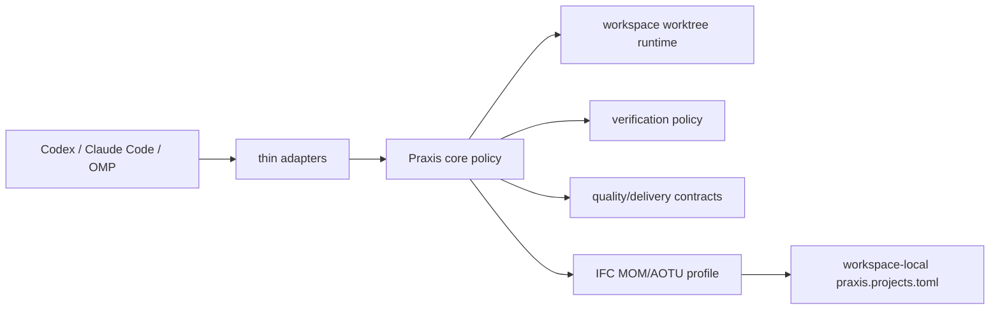

# Praxis Workflow Plugin

Portable Praxis workflow package for Codex, Claude Code, and OMP.

The package keeps platform adapters thin. Shared Praxis rules, profile sync logic, IFC MOM/AOTU assets, RTK fallback guidance, and vendored Ponytail 4.8.4 assets live in one portable core. Project-specific facts stay in each workspace: `praxis.projects.toml`, branch names, paths, verification commands, database names, and requirement records are never sourced from the plugin.

## Contents

- `praxis.plugin.toml`: shared plugin metadata rendered into platform adapters.
- `.codex-plugin/plugin.json`: Codex manifest for root `skills/`.
- `.claude-plugin/plugin.json` and `.claude-plugin/marketplace.json`: Claude Code manifest and local marketplace projection.
- `package.json`: OMP plugin entry with `omp.extensions` and `omp.skills`.
- `skills/`: Praxis, RTK, and vendored Ponytail skills.
- `commands/*.toml`: canonical command prompts; `commands/*.md` are generated for Markdown-command platforms.
- `runtime/praxis_core/`: platform-neutral task-policy and quick-task state contracts synced into workspaces.
- `hooks/`, `pi-extension/`, and `adapters/omp/`: Ponytail runtime plus Praxis session-start profile integration.
- `profiles/`: portable profile assets such as `ifc-mom`.
- `scripts/`: adapter generation, Ponytail vendoring, workspace init/check/sync scripts.
- `templates/`: project-neutral starter files and agent contracts.
- `workspaces.local.json`: ignored local registry for syncing this checkout to known workspaces.

## Install locally

Codex:

```bash
uv run python scripts/praxis_build_adapters.py --check
uv run --with PyYAML python "$HOME/.codex/skills/.system/plugin-creator/scripts/validate_plugin.py" "$PWD"
```

Claude Code:

```bash
claude plugin validate "$PWD"
claude --plugin-dir "$PWD" --no-session-persistence -p "/praxis-help"
```

OMP:

```bash
omp plugin link "$PWD"
omp plugin doctor --json
omp plugin list --json
```

Remote OMP distribution after configuring and publishing a remote repository:

```bash
omp plugin install github:faustofanb/praxis
```

Do not publish an `.omp-plugin/marketplace.json` projection until OMP marketplace installs load `package.json#omp.extensions`; otherwise Ponytail runtime would be silently omitted.

## Automatic workspace integration

After the plugin is installed and its lifecycle hook is trusted, opening an existing Praxis workspace automatically:

1. detects the workspace root from `praxis.toml` and `praxis.projects.toml`;
2. detects the installed packaged profile, such as `ifc-mom`;
3. compares only profile-managed files with the plugin copy;
4. repairs drift and prunes obsolete managed files under a PID lock;
5. leaves `praxis.projects.toml`, branches, database settings, requirements and business documents untouched.

Codex and Claude Code run the generated `SessionStart` hook from `hooks/hooks.json`. OMP runs `adapters/omp/praxis-auto-sync.mjs` and displays `Praxis active · <profile> · <status>`. Existing MOM/AOTU workspaces therefore do not need a manual profile-distribution command for each development session. A brand-new workspace still needs one initialization or an explicit profile marker.

Workspace opt-out:

```toml
# .praxis/plugin-sync.toml
schema_version = 1
id = "ifc-mom"
auto_sync = false
```

Codex custom instructions such as `@~/.codex/RTK.md` and `@~/.codex/Praxis.md` are no longer required after installing and trusting the plugin; keeping them would duplicate plugin rules. Workspace-local `@AGENTS.md` remains the source of project facts and should stay enabled.

## Workspace operations

```bash
python scripts/praxis_check_workspace.py <workspace> --json
python scripts/praxis_init_workspace.py <workspace> --name "IFC MOM" --profile ifc-mom
python scripts/praxis_sync_profile.py <workspace> ifc-mom --force
python scripts/praxis_sync_workspaces.py ifc-mom --force --dry-run
python scripts/praxis_sync_workspaces.py ifc-mom --force
```

`praxis_sync_workspaces.py` resolves the registry in this order: explicit `--registry`, `PRAXIS_WORKSPACES_REGISTRY`, then root `workspaces.local.json`. Missing all three is a hard configuration error. Single-workspace `praxis_sync_profile.py <workspace> <profile>` does not require a registry.

## Task modes

Workspace-local `praxis.projects.toml` remains the source of project paths, branches, commands and databases. Praxis adds two explicit execution modes:

```bash
# L0: isolated worktree + resumable .praxis/tasks/<id>.toml; no requirement docs
task project -- quick <project> <short-task-name>
task project -- quick-check <project> <short-task-name>

# L1/L2: retained requirement docs and the formal delivery lifecycle
task project -- start <project> <requirement-name> <original-user-request>
```

`quick` rejects database, migration, permission, report, shared-contract and cross-project policies. Worktree creation uses a configurable `developmentBranchPrefix` (default `praxis/`), exact-match ambiguity checks and per-project/task PID locks. RTK remains an optional optimization for human-facing shell output; machine-readable Git capture bypasses RTK filtering so workflow decisions parse raw Git output.

Verification is policy-driven: L0 runs the smallest changed-file and syntax/parser checks; L1 adds focused project tests; L2 adds high-risk migration/database/readiness checks and, when authorized, independent Quality review.



## Profile boundary

`profiles/ifc-mom/profile.toml` declares the portable profile id, version, extension root, managed roots, obsolete roots, and supported project kinds. `sync_profile()` copies only packaged profile assets and can prune stale managed files; it does not overwrite workspace-local `praxis.projects.toml` or local requirement records.

MOM and AOTU share canonical `ifc-mom` skills and rules. Their branch, database, path, and verification differences stay in each workspace-local `praxis.projects.toml`.

## Maintenance checks

```bash
uv run python scripts/praxis_verify_package.py
# Or run individual checks:
uv run python scripts/praxis_build_adapters.py --check
uv run python scripts/praxis_vendor_ponytail.py --check
uv run --with pytest pytest -q tests
```
